

<!-- _class: lead -->

# 🔴 ThinkPad-Musuem

#### How to start a (retro) podcast from scratch

 

Christian ~~Thinkowic~~ Stankowic
SUBSCRIBE 11
18.10.2024

---

<!-- _header: `whoami` -->

- Christian Stankowic
- [@stdevel@chaos.social](https://chaos.social/@stdevel) 🐘
- IT consultant and trainer 👨🏻‍🏫
- collects obsolete hardware
- Blogger ([cstan.io](https://cstan.io) 📖)
- Podcaster 🎙️
  - [FOCUS ON: Linux](https://focusonlinux.podigee.io) 🐧
  - [Faxinformatiker](https://faxinformatiker.de) 📠
  - [ThinkPad-Museum](https://thinkpad-museum.de/episode) 💻

<!--

- Blog since 2008 (=16)
- was late to the party: only discovered podcasts during the pandemic
  - started with LNP and Chaosradio and then discovered more podcasts

-->

---

<!-- _header: ThinkPad museum -->

- Online museum as **blog**
- lists collection details
  - **57** <u>different</u> notebooks
  - **3** PDAs
  - **10** Docking stations
  - ∞ batteries and cables
- monthly **podcast** (🇩🇪)
- 🔴 [thinkpad-museum.com](https://thinkpad-museum.com)

---

<!-- _header: ThinkPad museum -->

Part of the collection

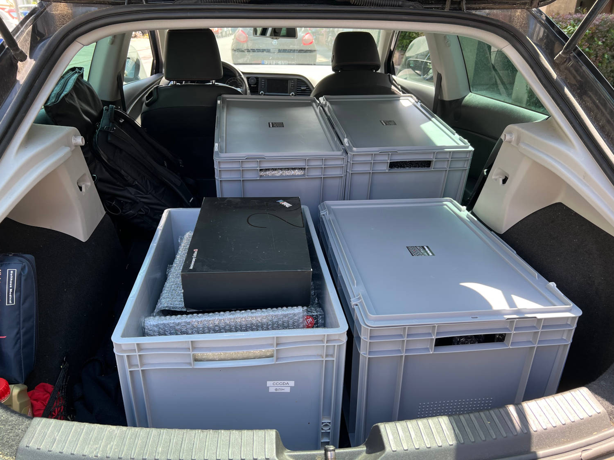

Transporting the collection

---

<!-- _header: Agenda -->

1. Path to the idea 💡
1. Branding and organization 📝
1. Tools and workflow 🔨
1. Hosting and marketing 👨🏻‍💻

---

<!-- _header: Seriously - why? -->

- Why not? 🙃

- **Enthusiasm** for the topic
- ThinkPads are still to be found in business and hacker circles
- also pop-culturally relevant
- Eventful history with lots of **trivia** and **curiosities**
  - Industrial design
  - Absurd hardware concepts

---

<!-- _header: Seriously - why? -->

- Initial **surveys** among friends and on Mastodon were **optimistic**
- Respect for incalculable effort

- podcast friend invited me to this very topic
  - “*briefly touching on the topic*”
  - [HK003 - ThinkPads](https://hacker-kultur.de/episodes/003.html) 🎙️
  - **02:28:55** 🫢

---

<!-- _header: ThinkPads 101 💻 -->

- have been produced since **1992**
- stand for **durable** devices
- **timeless** design, practical
- many curious **experiments**
  - PDAs (IBM WorkPad)
  - PowerPC and ARM notebooks
  - unusual expansion modules
  - Notebooks with **two displays**
- popular due to good **Linux** support, among other things

Rabbit Hole in a nutshell

<!--

- The PPC notebooks ran UNIX (IBM AIX)
- Curious modules: fold-out Numpad, PDA docking station and TV tuner

-->

---

<!-- _header: Product design on fleek: IBM PC Convertible Model 5140 (1986) -->
<!-- footer: '[[1]](https://richardsapperdesign.com/products/mod-5140/)' -->

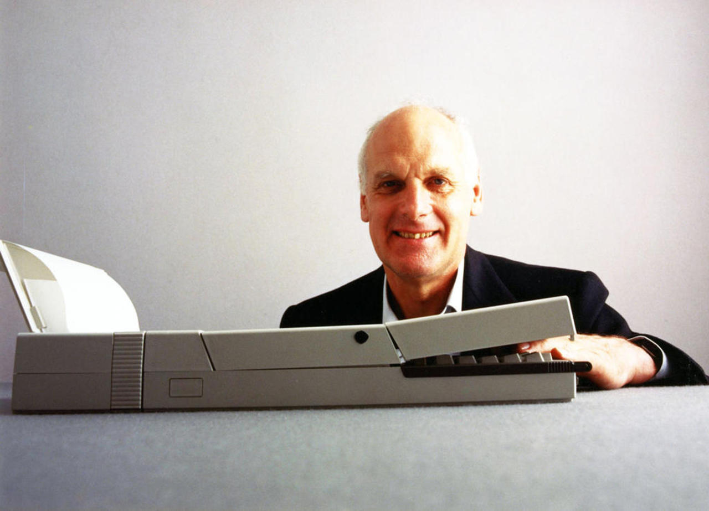

<!--

- Notebook looks like a crocodile when viewed from the side
- Allusion to the production site in Boca Raton (Florida), where there was an alligator infestation
- in the background: Richard Sapper
  - one of the most important product designers of the 2nd half of the 20th century
  - won numerous prizes for his designs

-->

---

<!-- _header: Stylish table lamp, pop-cultural relevance -->
<!-- footer: '[[2]](https://commons.wikimedia.org/wiki/File:Lampe_Tizio_von_Richard_Sapper.jpg), [[3]](https://productplacementblog.com/movies/lenovo-thinkpad-t61-laptop-used-by-christopher-plummer-as-harlan-thrombey-in-knives-out-2019/)' -->

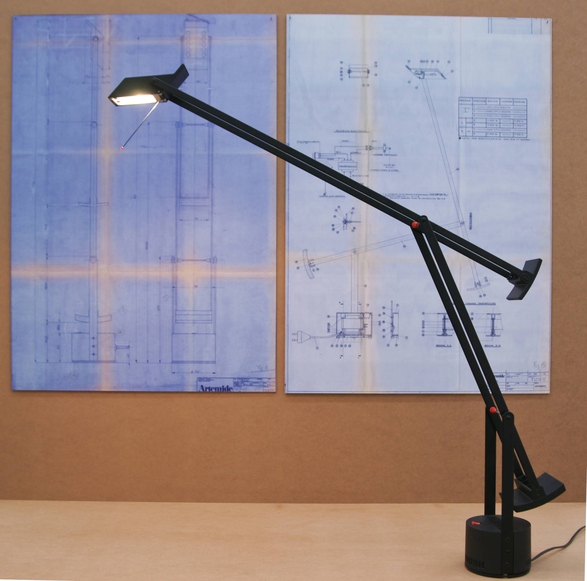

Artemide Tizio (1972)

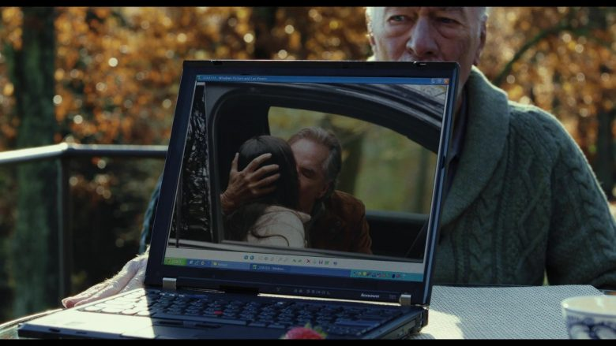

Knives Out (2019)

<!-- 
- Lamp worked without visible cables
  - could be easily adjusted without springs
  - Counterweights increase stability and complement the design
- TPs have also been appearing outside of “nerd films” for a long time
-->

---

<!-- _header: Unusual keyboards and screens -->
<!-- footer: '[[4]](https://en.wikipedia.org/wiki/File:IBM_ThinkPad_701C_keyboard.jpg), [[5]](https://thinkwiki.de/W701)' -->

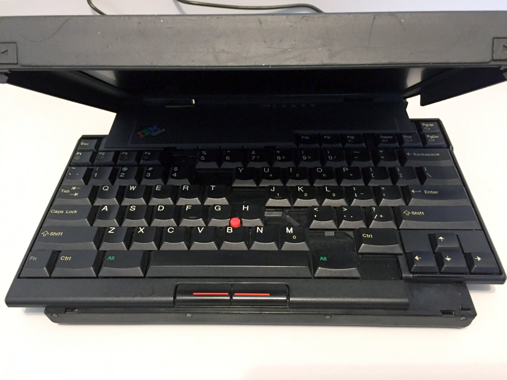

ThinkPad 701C (1995)

ThinkPad W701ds (2010)

<!--
- 701c can be found in the Museum of Modern Art in New York, among others
-->

---

<!-- _header: Ahead of its time: tablets that no one wanted (yet) -->
<!-- footer: '[[6]](https://richardsapperdesign.com/products/leapfrog/), [[7]](https://commons.wikimedia.org/wiki/Category:ThinkPad_360PE)' -->

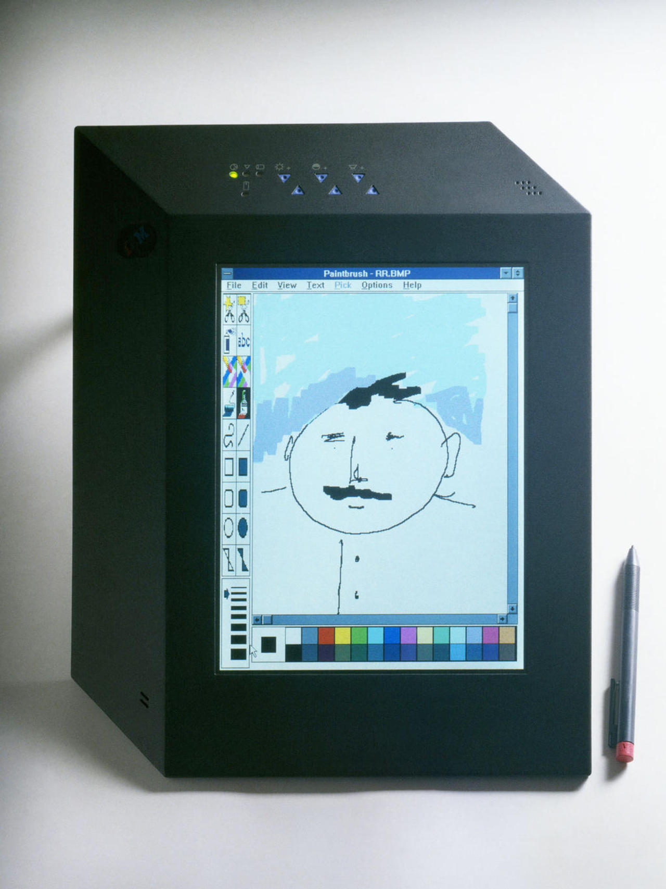

IBM Leapfrog (1992)

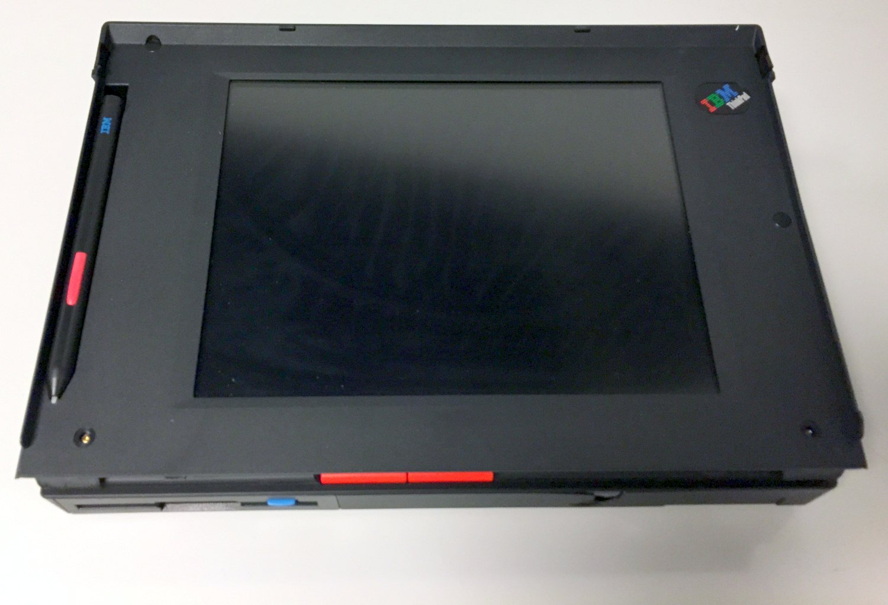

ThinkPad 360PE (1995)

---

<!-- _header: Why as podcast? -->
<!-- footer: 'Do you remember the last 3 slides? 🥲' -->

- People suffer from a decreasing **attention span***
  - Blogs are read less and **less often** (attentively)
- Video is too time-consuming, [already exists](https://www.youtube.com/channel/UC-wmf-Avorzz9QPKzdYFgeg)
- I wanted to learn something **new**, I like listening to podcasts
  - **market analysis** has shown that there is no such thing yet
  - deliberately made in German, accepted smaller bubble

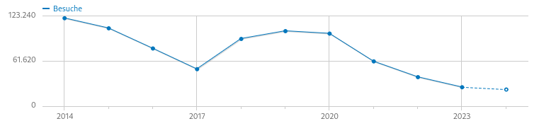

---

<!-- _header: Planned formats -->
<!-- footer: '' -->

**Variety** important right from the start to get people excited:

- **History** - Historical context to IBM and co.
- **People** - designers, engineers, **community**
- **Model** - individual devices and series
- **Technology** - e.g. VGA, Windows 3.x

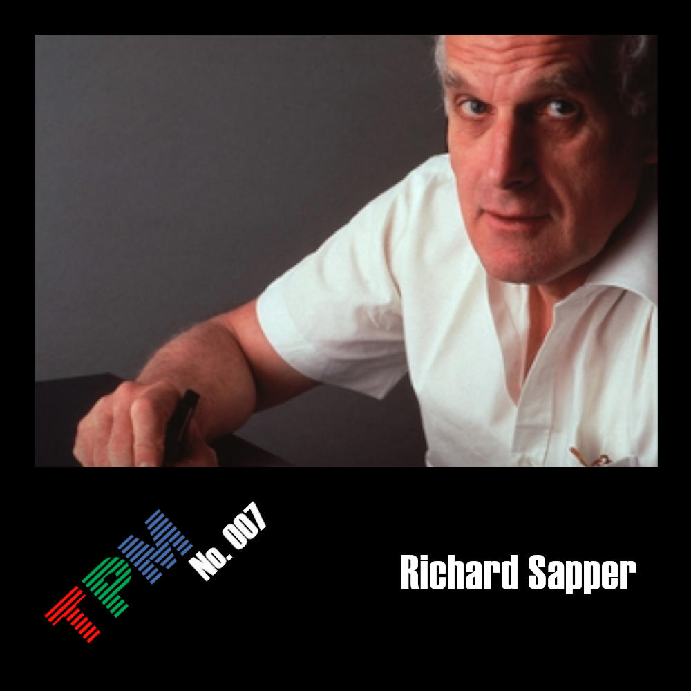

---

<!-- _header: Technical wishes -->
<!-- footer: 'Thank you, [Stay Forever](https://www.stayforever.de/)!' -->

- Chapter markers and show notes
  - should be self-evident
- **Audio-visual** medium
- Usefully supplement audio with **chapter images***
  - e.g. detailed shots of the devices
  - Consideration: Context must also be provided without images
- **Transcripts**
  - Accessibility and SEO

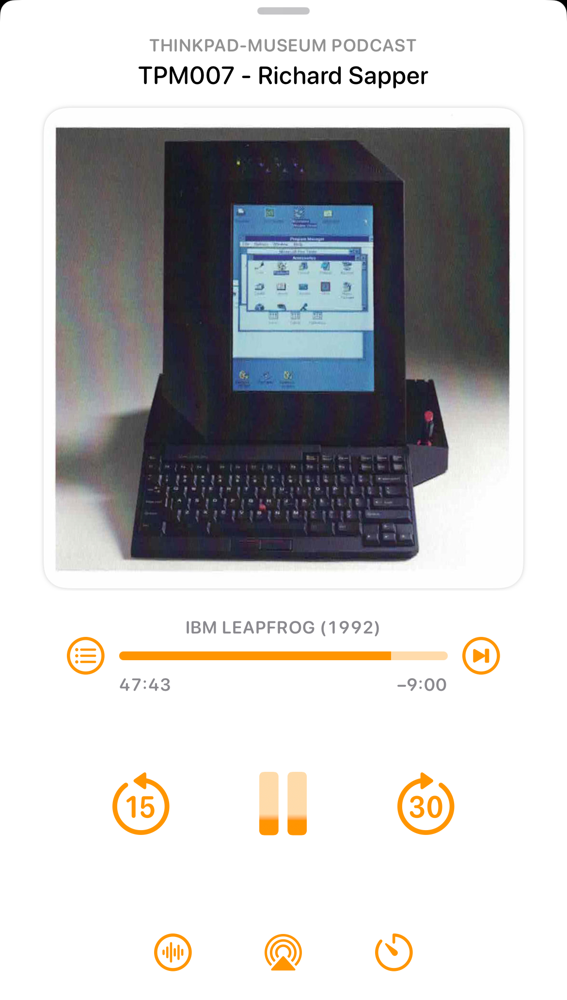

<!--
- Transcripts are not only interesting for deaf people, people with concentration difficulties also benefit from them
-->

---

<!-- _header: Branding -->
<!-- footer: 'No, this does _not_ stand for **T**rusted **P**latform **M**odule! 🤡' -->

- ThinkPad Museum was obvious, ThinkPod already taken
- **TPM*** as episode prefix
- **Cover** with TrackPoint for direct association
- **Audio scheme**
  - Searched **catalogs** (e.g. [AudioJungle](https://audiojungle.net/)) for hours
  - wanted an electronic scheme with iconic ThinkPad **sounds**
  - Musicians in my circle of friends created exactly that 🥰

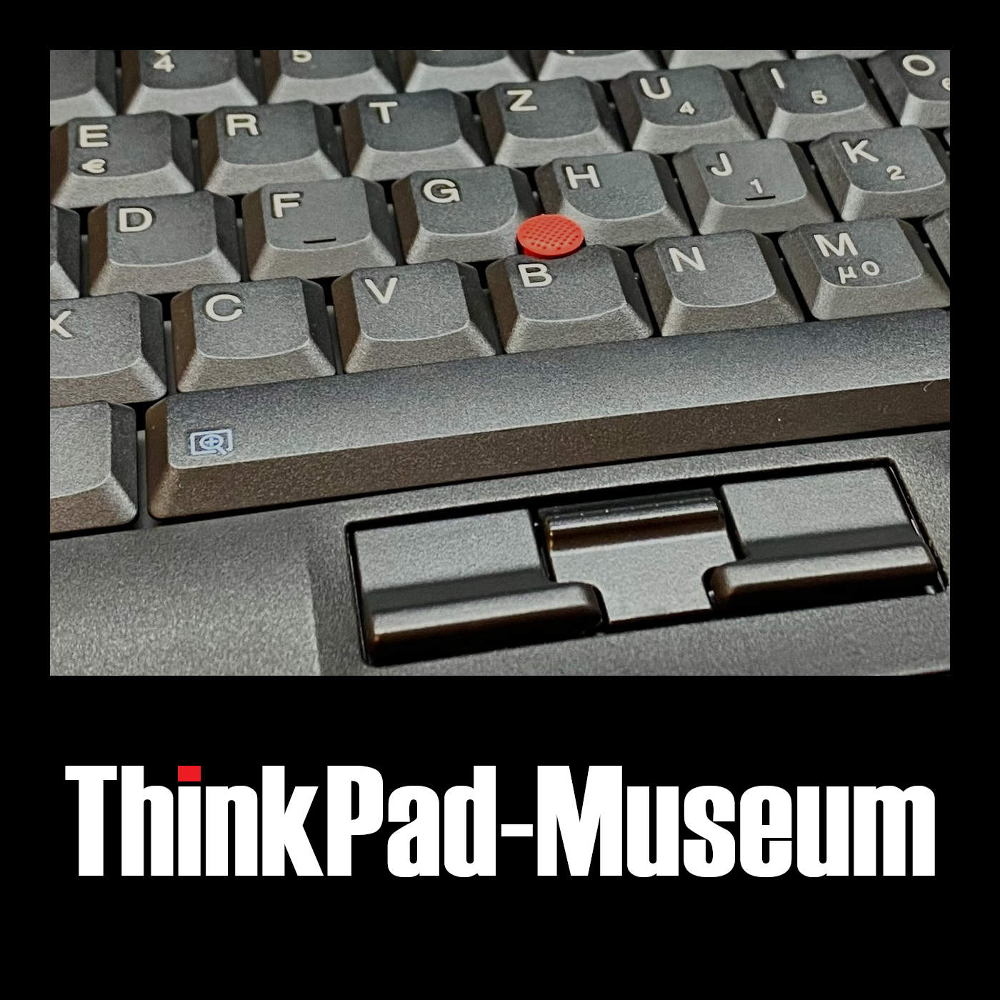

<audio controls>
  <source src="imgs/tp_sounds.mp3" type="audio/mpeg">
Your browser does not support the audio element.
</audio> 

<audio controls>
  <source src="imgs/tpm_intro.mp3" type="audio/mpeg">
Your browser does not support the audio element.
</audio>

---

<!-- _header: Work organization -->
<!-- footer: 'A desktop wiki or cloud service will do as well' -->

- **Markdown** documents in **Git** repositories*
  - Repos for episodes, artwork, website
  - Lesseons Learned: Git **LFS** for large images
- **Kanban board** and issues for episode planning
  - **Tags** for different topics
- **Two** Markdown documents per episode
  - Content keywords and chapters (`notes.md`)
  - Research notes and source collections (`dossier.md`)

<!--
- Repository can be shared with guests
- do not read, but key points and moderation instructions help
  - big difference between recording a podcast alone vs. with several people
 -->

---

<!-- _header: Work organization -->
<!-- footer: '' -->

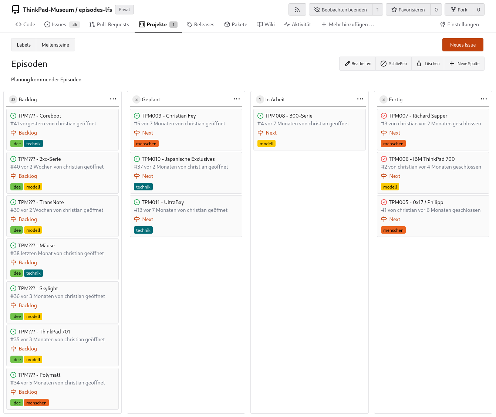

---

<!-- _header: Tools -->
<!-- footer: 'Stable Linux version when? 👉🏻👈🏻🥹' -->

- Focusrite **Scarlett Solo** Gen 3 + beyerdynamic **DT 797 PV**
  - something cheaper will do as well (e.g. RØDE NT-USB Mini)
  - I find headsets easier to use than stand mics
- [REAPER](https://www.reaper.fm/) and [UltraSchall](https://ultraschall.fm/)*, [Studio-Link](https://studio-link.de/) for guests
- Scheduling with [nuudel](https://nuudel.digitalcourage.de/)
- [GIMP](https://www.gimp.org/) for images and artwork
- [whisper.cpp](https://github.com/ggerganov/whisper.cpp) for transcripts
- Static website with [Hugo](https://gohugo.io/)
  - customized [`hello-friend-ng` theme](https://github.com/rhazdon/hugo-theme-hello-friend-ng)

<!--
- Scarlett Solo approx. 99 EUR
- DT 797 PV approx. 450 EUR
- UltraSchall perfect for people who know little about audio
  - UltraSound on MacBook Pro instead of ThinkPad 🥲
-->

---

<!-- _header: Workflow -->
<!-- footer: '' -->

1. Topic selection (from backlog)
1. **Research** (Internet, books)
1. Recording
1. Editing and post-production
1. Chapter markers and **images**
1. Audio export
1. Create **transcript**

= **~10h** per episode ⏲️

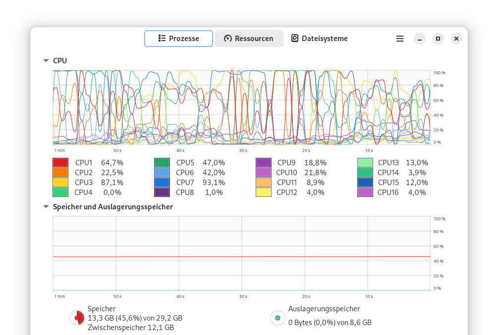

CPU goes brrr 🔥

---

<!-- _header: Editing and post-production -->

- Cut speech pauses and **spoilers**
- Remove background noise
- Normalize **-23 LUFS** voice tracks
- Activate per **voice track**
  - VST: ReaEQ (Cockos)
  - JS: Ultrasonic Dynamics
- JS: Activate LUFS Loudness Metering on **Mastertrack**
- Export with **Meta** information
  - Title, author, podcast, year, category and description

---

<!-- _header: Transcripts -->
<!-- footer: '' -->

- There are numerous **services** for automated transcripts
  - Cost per minute/episode (or personal data)
- Running a museum is costly enough 🫠
  - also friend of **self-hosting**
  - Web server and local computing power are already available

- [OpenAI Whisper](https://github.com/openai/whisper) is a free model for **speech recognition**
  - can be used on your own hardware
  - but requires a **NVIDIA** graphics card
  - with [whisper.cpp](https://github.com/ggerganov/whisper.cpp) there is a fork with **CPU** support
  - requires **~1.5 times** the episode length on my hardware

---

<!-- _header: Hosting -->

- There are numerous hosting offers with fair prices
- In principle, however, a simple web server will do the trick
  - Feeds can also be created with tools like [Hugo](https://brendamour.net/2021/04/18/how-to-publish-podcasts-with-the-hugo-static-site-generator/)
  - There are also plugins for common **CMS** such as WordPress

- I came across [Castopod](https://castopod.org/) in the Fediverse
  - successfully **generdsniped** the regional Mastodon instance operator
  - first podcast on [podcasts.darmstadt.social](https://podcasts.darmstadt.social/) 🎉

---

<!-- _header: Castopod -->

- **Open source platform** for podcast hosting
- Easy to use WebUI
- supports **ActivityPub**
  - Can be subscribed to directly from Mastodon and co.
  - Community interaction
- numerous **additional functions**
  - themes
  - SEO, monetization

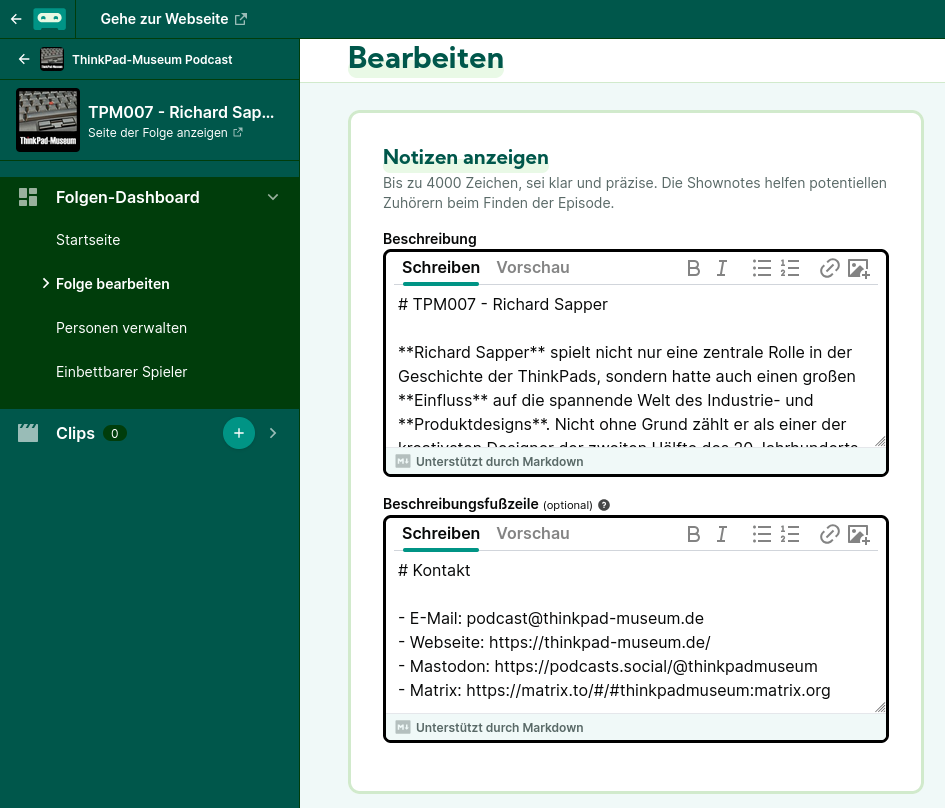

<!--

- enables multiple users and podcast feeds

-->

---

<!-- _header: Castopod -->

- developed in **PHP**
- can also be hosted via **Docker** or Podman

- Nasty **pitfall**: [missing `range-requests` support in the pre-built container image](https://code.castopod.org/adaures/castopod/-/issues/446)
  - absolutely required by **Apple Podcasts** for episode streams
  - Troubleshooting [despite great help](https://sendegate.de/t/apple-podcasts-die-folge-konnte-nicht-wiedergegeben-werden-versuche-es-erneut/16806) was not trivial
  - Lessons learned: [Validate feed URL](https://www.castfeedvalidator.com/)

---

<!-- _header: Validate feed -->

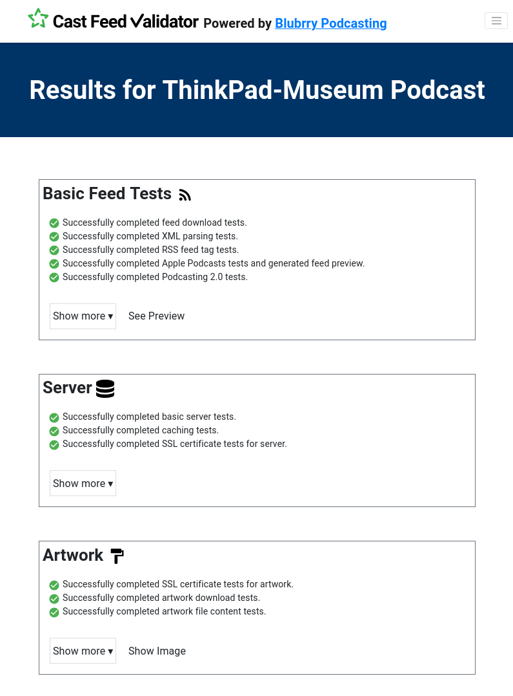

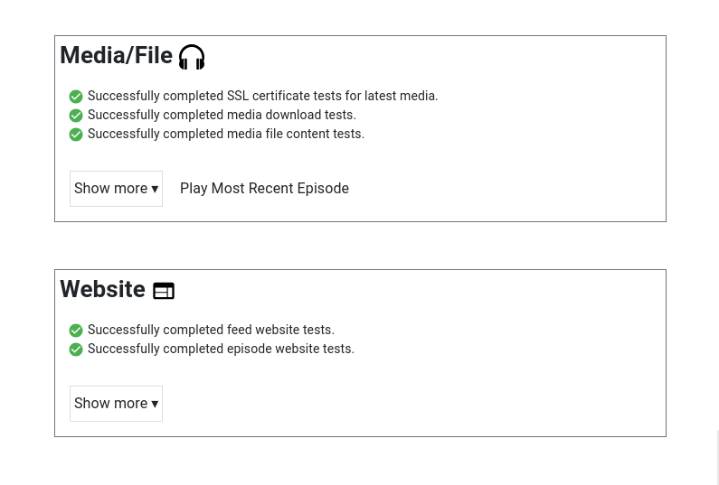

---

<!-- _header: Marketing -->

- An account on [podcasts.social](https://podcasts.social) is mandatory!
  - Posts for **episodes**, but also direct community **interaction**
  - Best Practice: **Pin** current episode to profile
  - Build a **bubble**: Track **hashtags**, participate in **conversations**

- Enter the feed in databases such as [fyyd](https://fyyd.de/)
  - there are often special interest projects, such as [wisspod](https://wissenschaftspodcasts.de/)
- Participate in other **communities** (e.g. [thinkpad-forum.de](https://thinkpad-forum.de))

- Attend conferences like this one (duh!)
  - People love **stickers** ✨
- **Collaborations** with friendly podcasts

<!--
- Post something with the #thinkpad hashtag and I'll most likely reply to you
-->

---

<!-- _header: Analytics -->

- Self-hosted [Matomo](https://matomo.org/) for the **website** (clicks/sources)
- [Mastometrics](https://mastometrics.com) for Mastodon** interactions**
- [OP3](https://op3.dev/) (**O**pen **P**odcast **P**refix **P**roject) for **episode** downloads
  - Client information about redirects, requires feed customization

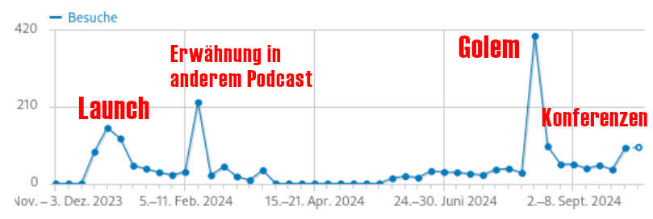

<!--

- Podcasting should be fun, please don't take analytics too seriously
- OP3
  - Open source service for data protection-compliant podcast metrics
  - free API, source code can be viewed on GitHub

-->

---

<!-- _header: Analytics (Mastometrics) -->

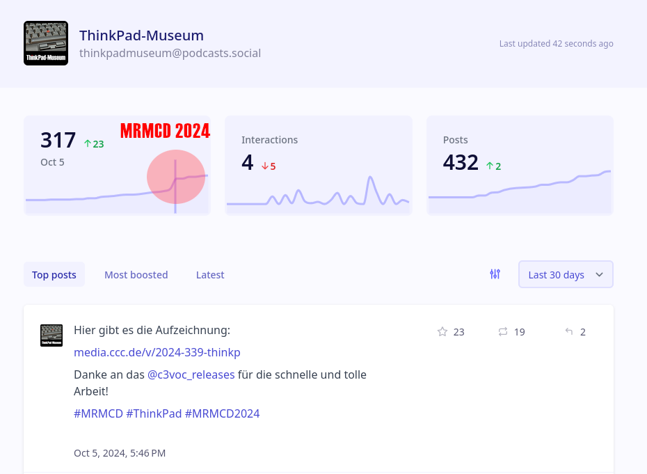

---

<!-- _header: Analytics (OP3) -->

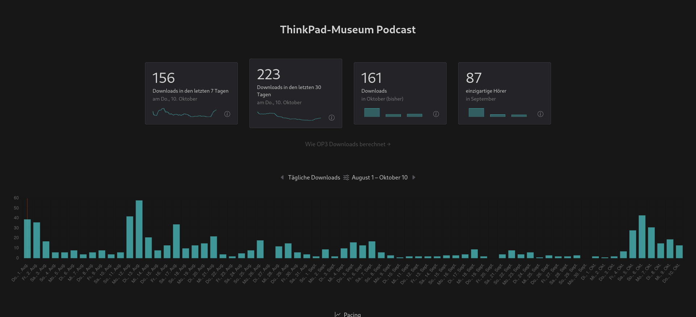

---

<!-- _header: Analytics (OP3) -->

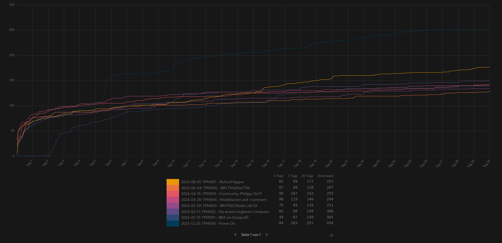

---

<!-- _header: Conclusion and outlook -->

- Producing podcasts **is fun**
  - there is a niche bubble for **everything**
  - but the podcast scene is happy about curious topics
  - Just try it out - **diversity** is good!

---

<!-- _header: Links and image sources -->

- [MRMCD 2024: ThinkPads - Eingabegeräte und Kuriositäten (Teil 2)](https://media.ccc.de/v/2024-339-thinkpads-geschichte-und-trivia) 🎥
- [FrOSCon 2024: ThinkPads - Geschichte und Nerdkultur (Teil 1)](https://media.ccc.de/v/froscon2024-3141-thinkpads) 🎥
- [BW099 - Ein denkwürdiges Notebook](https://besserwissen.podigee.io/99-thinkpad) 🎙️
- [HK003 - ThinkPads](https://hacker-kultur.de/episodes/003.html) 🎙️
- [ThinkPad sounds](https://www.youtube.com/watch?v=G9vCBDV4ts4)
- [ThinkPad museum](https://thinkpad-museum.com)

1. [IBM PC Convertible Model 5140](https://richardsapperdesign.com/products/mod-5140/)
1. [Artemide Tizio](https://commons.wikimedia.org/wiki/File:Lampe_Tizio_von_Richard_Sapper.jpg)
1. [ThinkPad T61 (Knives Out)](https://productplacementblog.com/movies/lenovo-thinkpad-t61-laptop-used-by-christopher-plummer-as-harlan-thrombey-in-knives-out-2019/)
1. [ThinkPad 701C](https://en.wikipedia.org/wiki/File:IBM_ThinkPad_701C_keyboard.jpg)
1. [ThinkPad W701](https://thinkwiki.de/W701)
1. [IBM Leapfrog](https://richardsapperdesign.com/products/leapfrog/)
1. [ThinkPad 360PE](https://commons.wikimedia.org/wiki/Category:ThinkPad_360PE)

---

<!-- _class: lead -->

# 🔴 Thank you for your attention
