

<!-- _class: lead -->

# 🔴 ThinkPad-Musuem

#### Wie man einen (Retro-)Podcast from scratch startet

 

Christian ~~Thinkowic~~ Stankowic
SUBSCRIBE 11
18.10.2024

---

<!-- _header: `whoami` -->

- Christian Stankowic
- [@stdevel@chaos.social](https://chaos.social/@stdevel) 🐘
- IT-Berater und -Trainer 👨🏻‍🏫
- sammelt obsolete Hardware
- Blogger ([cstan.io](https://cstan.io) 📖)
- Podcaster 🎙️
  - [FOCUS ON: Linux](https://focusonlinux.podigee.io) 🐧
  - [Faxinformatiker](https://faxinformatiker.de) 📠
  - [ThinkPad-Museum](https://thinkpad-museum.de/episode) 💻

<!--

- Blog seit 2008 (=16)
- war late to the party: habe Podcasts erst in der Pandemie für mich entdeckt
  - mit LNP und Chaosradio angefangen und dann weitere Podcasts entdeckt

-->

---

<!-- _header: ThinkPad-Museum -->

- Online-Museum als **Blog**
- listet Details der Sammlung auf
  - **57** <u>unterschiedliche</u> Notebooks
  - **3** PDAs, **1** Tablet
  - **10** Docking Stationen
  - ∞ Akkus und Kabel
- monatlicher **Podcast**
- 🔴 [thinkpad-museum.de](https://thinkpad-museum.de)

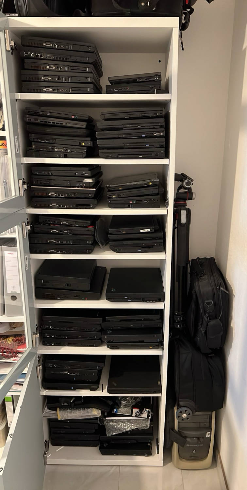

---

<!-- _header: ThinkPad-Museum -->

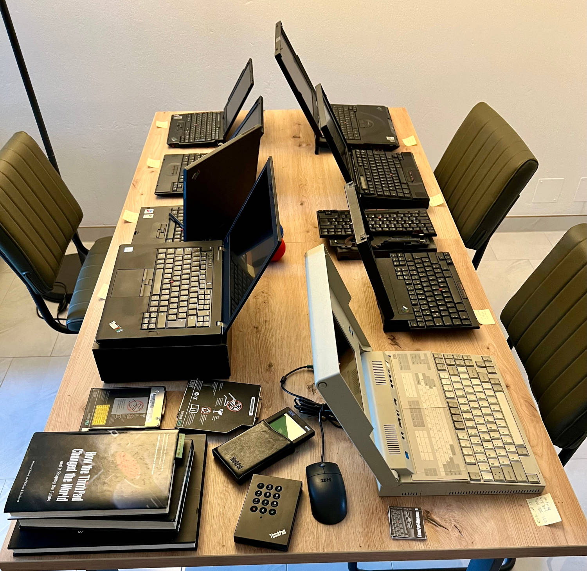

Teil der Sammlung

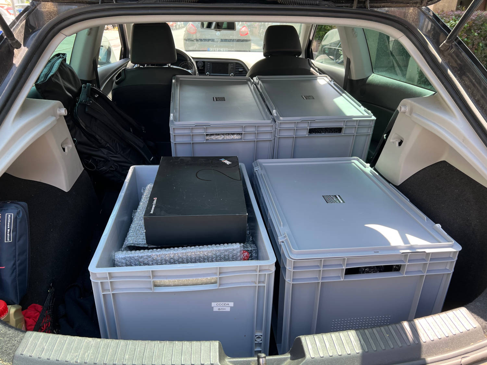

Transport der Sammlung

---

<!-- _header: Agenda -->

1. Weg zur Idee 💡
1. Branding und Organisation 📝
1. Tools und Workflow 🔨
1. Hosting und Marketing 👨🏻‍💻

---

<!-- _header: Mal im Ernst - warum? -->

- Wieso eigentlich nicht? 🙃

- **Begeisterung** für das Thema
- ThinkPads sind immernoch in Business- und Hacker:innen-Kreisen anzutreffen
- auch popkulturell relevant
- Bewegte Geschichte mit viel **Trivia** und **Kuriositäten**
  - Industriedesign
  - Absurde Hardware-Konzepte

---

<!-- _header: Mal im Ernst - warum? -->

- erste **Umfragen** im Bekanntenkreis und auf Mastodon waren **optimistisch**
- Respekt vor nicht kalkulierbarem Aufwand

- befreundeter Podcast lud mich zu genau diesem Thema ein
  - "*Kurz das Thema anreißen*"
  - [HK003 - ThinkPads](https://hacker-kultur.de/episodes/003.html) 🎙️
  - **02:28:55** 🫢

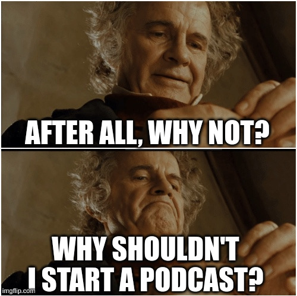

---

<!-- _header: ThinkPads 101 💻 -->

- werden seit **1992** produziert
- stehen für **langlebige** Geräte
- **zeitloses** Design, praktikabel
- vielen kuriose **Experimente**
  - PDAs (IBM WorkPad)
  - PowerPC- und ARM-Notebooks
  - unübliche Erweiterungsmodule
  - Notebooks mit **zwei Displays**
- u.a. wegen gutem **Linux**-Support beliebt

Rabbit Hole in a nutshell

<!--

- Auf den PPC-Notebooks lief UNIX (IBM AIX)
- Kuriose Module: ausklappbares Numpad, PDA-Docking Station und TV-Tuner

-->

---

<!-- _header: Produktdesign on fleek: IBM PC Convertible Model 5140 (1986) -->
<!-- footer: '[[1]](https://richardsapperdesign.com/products/mod-5140/)' -->

<!--

- Notebook sieht seitlich betrachtet wie ein Krokodil aus
- Anspielung auf den Produktionsstandort Boca Raton (Florida), wo eine Alligator-Plage herrschte
- im Hintergrund: Richard Sapper
  - einer der bedeutendsten Produktdesigner der 2.Hälfe des 20.Jahrhunderts
  - gewann zahlreiche Preise für seine Designs

-->

---

<!-- _header: Stilvolle Tischlampe, popkulturelle Relevanz -->
<!-- footer: '[[2]](https://commons.wikimedia.org/wiki/File:Lampe_Tizio_von_Richard_Sapper.jpg), [[3]](https://productplacementblog.com/movies/lenovo-thinkpad-t61-laptop-used-by-christopher-plummer-as-harlan-thrombey-in-knives-out-2019/)' -->

Artemide Tizio (1972)

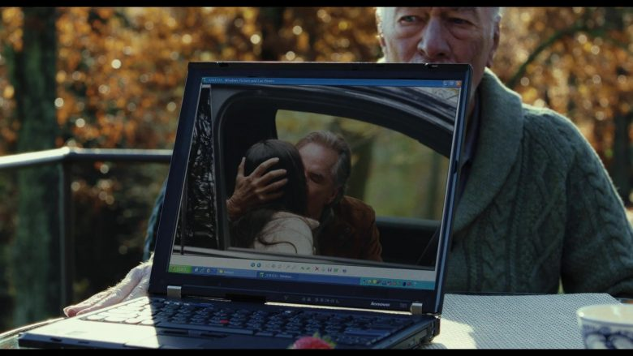

Knives Out (2019)

<!-- 
- Lampe kam ohne sichtbare Kabel aus
  - konnte ohne Federn einfach justiert werden
  - Gegengewichte erhöhen Stabilität und ergänzen das Design
- TPs treten schon lange auch außerhalb von "Nerdfilmen" auf
-->

---

<!-- _header: Unübliche Tastaturen und Bildschirme -->
<!-- footer: '[[4]](https://en.wikipedia.org/wiki/File:IBM_ThinkPad_701C_keyboard.jpg), [[5]](https://thinkwiki.de/W701)' -->

ThinkPad 701C (1995)

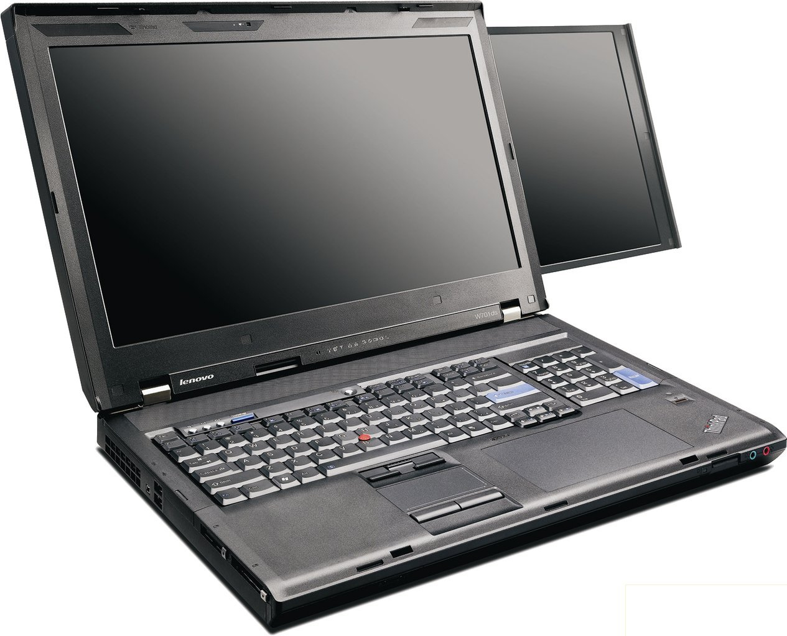

ThinkPad W701ds (2010)

<!--
- 701c steht u.a. im Museum of Modern Art in New York
-->

---

<!-- _header: Der Zeit voraus: Tablets, die (noch) keine:r wollte -->
<!-- footer: '[[6]](https://richardsapperdesign.com/products/leapfrog/), [[7]](https://commons.wikimedia.org/wiki/Category:ThinkPad_360PE)' -->

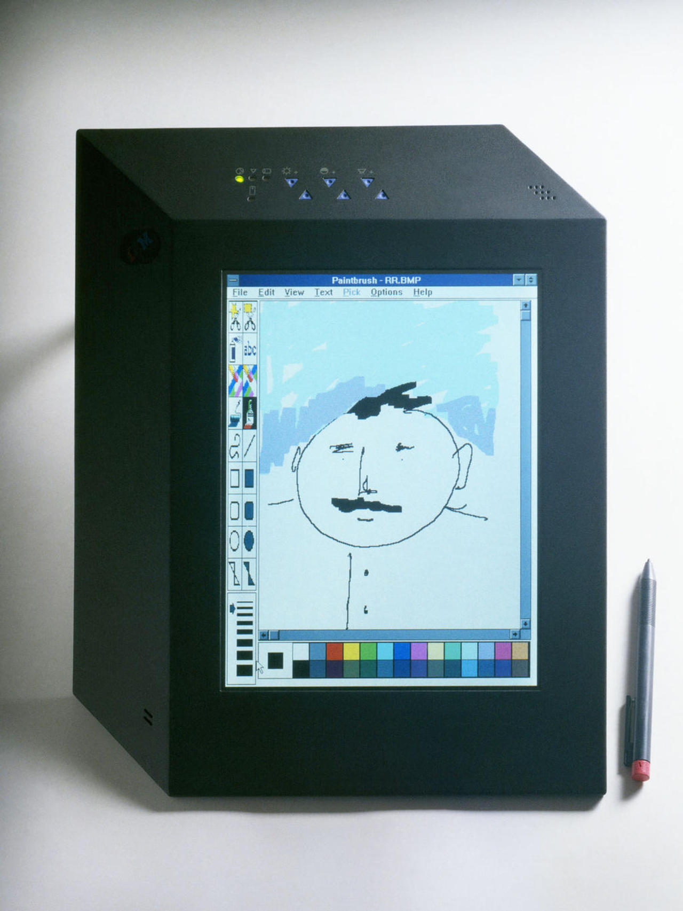

IBM Leapfrog (1992)

ThinkPad 360PE (1995)

---

<!-- _header: Warum als Podcast? -->
<!-- footer: 'Erinnerst Du dich noch an die 3 letzten Folien? 🥲' -->

- Menschen leiden unter einer sinkender **Aufmerksamkeitsspanne***
  - Blogs werden immer **seltener** (aufmerksam) gelesen
- Video ist zu aufwändig, [gibt es außerdem bereits](https://www.youtube.com/channel/UC-wmf-Avorzz9QPKzdYFgeg)
- ich wollte etwas **Neues lernen**, höre selbst gerne Podcasts
  - **Marktanalyse** hat gezeigt, dass es derartiges noch nicht gibt
  - bewusst auf deutsch gemacht, kleinere Bubble in Kauf genommen

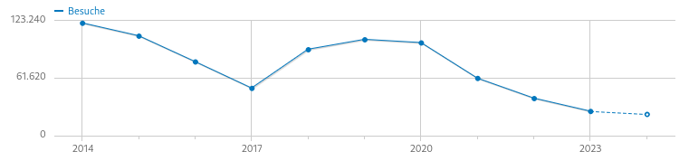

---

<!-- _header: Geplante Formate -->
<!-- footer: '' -->

**Abwechslung** von Anfang an wichtig, um Leute zu begeistern:

- **Geschichte** - Historischer Kontext zu IBM und co.
- **Menschen** - Designer:innen, Ingenieur:innen, **Community**
- **Modell** - einzelne Geräte/Serien
- **Technik** - z.B. VGA, Windows 3.x

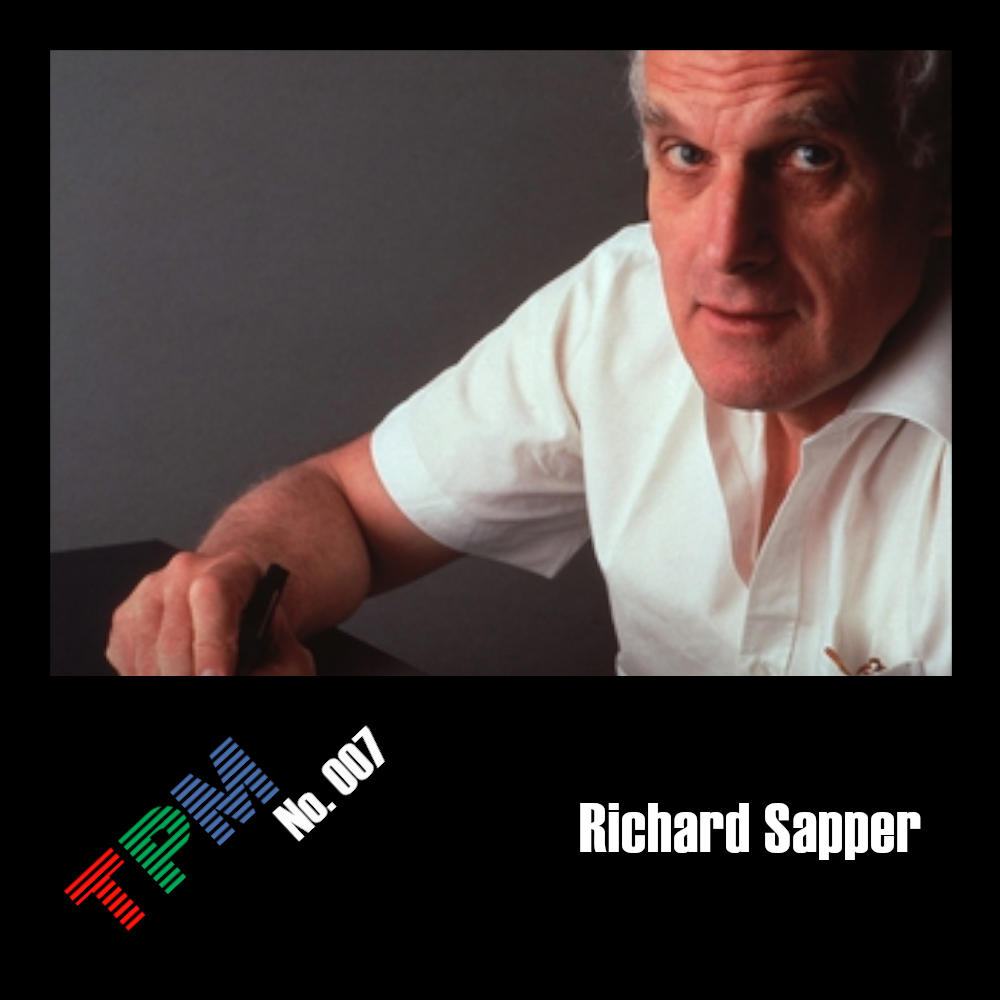

---

<!-- _header: Technische Wünsche -->
<!-- footer: 'Danke, [Stay Forever](https://www.stayforever.de/)!' -->

- Kapitelmarken und Shownotes
  - sollten selbstverständlich sein
- **Audio-visuelles** Medium
- Ton sinnvoll mit **Kapitelbildern*** ergänzen
  - z.B. Detailshots der Geräte
  - Abwägung: Kontext muss auch ohne Bilder gegeben sein
- **Transkripte**
  - Barrierefreiheit und SEO

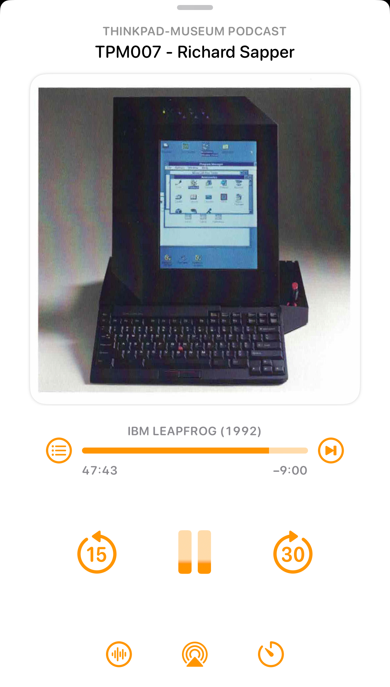

<!--
- Transkripte nicht nur für Gehörlose interessant, auch Menschen mit Konzentrationsschwierigkeiten profitieren davon
-->

---

<!-- _header: Branding -->
<!-- footer: 'Nein, das steht _nicht_ für **T**rusted **P**latform **M**odule! 🤡' -->

- ThinkPad-Museum war naheliegend, ThinkPod bereits vergeben
- **TPM*** als Episoden-Prefix
- **Cover** mit TrackPoint für direkte Assoziation
- **Audioschema**
  - Stundenlang die üblichen **Kataloge** (u.a. [AudioJungle](https://audiojungle.net/)) durchsucht
  - wollte ein elektronisches Schema mit ikonischen ThinkPad-**Sounds**
  - Musiker im Bekanntenkreis kreierte exakt das 🥰

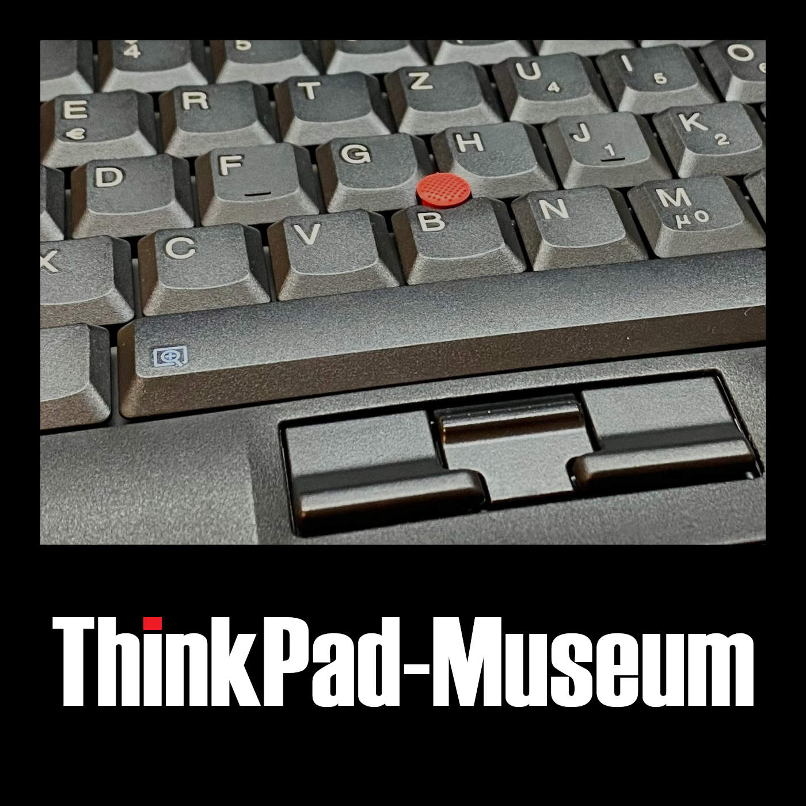

<audio controls>
  <source src="imgs/tp_sounds.mp3" type="audio/mpeg">
Your browser does not support the audio element.
</audio> 

<audio controls>
  <source src="imgs/tpm_intro.mp3" type="audio/mpeg">
Your browser does not support the audio element.
</audio>

---

<!-- _header: Arbeitsorganisation -->
<!-- footer: 'Ein Desktop-Wiki oder Cloud-Dienst tut es auch' -->

- **Markdown**-Dokumente in **Git**-Repositories*
  - Repos für Episoden, Artwork, Webseite
  - Lesseons Learned: Git **LFS** für große Bilder
- **Kanban-Board** und Issues für Episoden-Planung
  - **Tags** für verschiedene Themen
- Pro Episode **zwei** Markdown-Dokumente
  - Inhaltliche Stichpunkte und Kapitel (`notes.md`)
  - Recherche-Notizen und Quellensammlungen (`dossier.md`)

<!--
- Repository kann mit Gäst:innen geteilt werden
- nicht ablesen, aber Stichpunkte und Moderationsanweisungen helfen
  - großer Unterschied alleine einen Podcast aufzunehmen vs. mit mehreren Menschen
 -->

---

<!-- _header: Arbeitsorganisation -->
<!-- footer: '' -->

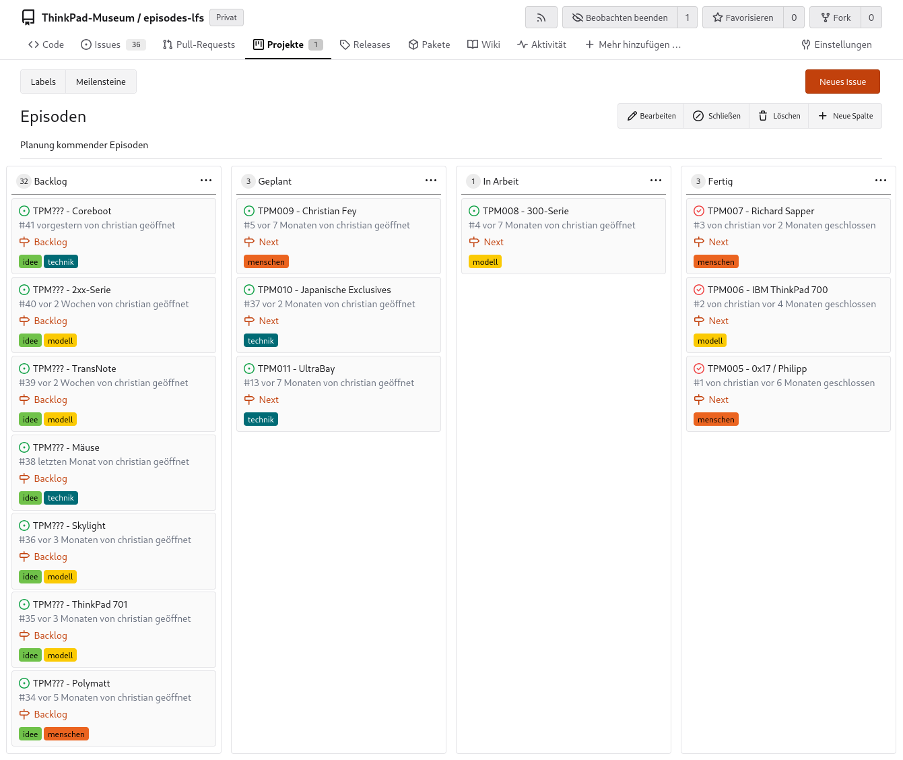

---

<!-- _header: Tools -->
<!-- footer: 'Stabile Linux-Version wann? 👉🏻👈🏻🥹' -->

- Focusrite **Scarlett Solo** Gen 3 + beyerdynamic **DT 797 PV**
  - hier tut es auch was Günstigeres (z.B. RØDE NT-USB Mini)
  - ich finde Sprechgarnituren einfacher zu nutzen als Standmikrofone
- [REAPER](https://www.reaper.fm/) und [UltraSchall](https://ultraschall.fm/)*, [Studio-Link](https://studio-link.de/) für Gäst:innen
- Terminplanung mit [nuudel](https://nuudel.digitalcourage.de/)
- [GIMP](https://www.gimp.org/) für Bilder und Artwork
- [whisper.cpp](https://github.com/ggerganov/whisper.cpp) für Transkripte
- Statische Webseite mit [Hugo](https://gohugo.io/)
  - angepasstes [`hello-friend-ng` Theme](https://github.com/rhazdon/hugo-theme-hello-friend-ng)

<!--
- Scarlett Solo ca. 99 EUR
- DT 797 PV ca. 450 EUR
- UltraSchall perfekt für Leute die wenig Ahnung von Audio haben
  - UltraSchall auf MacBook Pro statt ThinkPad 🥲
-->

---

<!-- _header: Workflow -->
<!-- footer: '' -->

1. Themenauswahl (aus Backlog)
1. **Recherche** (Internet, Bücher)
1. Aufzeichnung
1. Schnitt und Post-Production
1. Kapitelmarken und **-bilder**
1. Export
1. **Transkript** erstellen lassen

= **~10h** pro Episode ⏲️

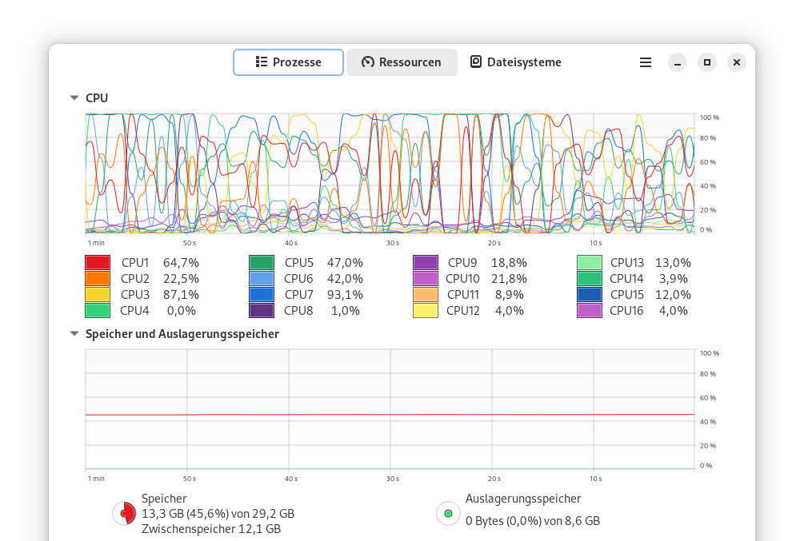

CPU goes brrr 🔥

---

<!-- _header: Schnitt und Postproduction -->

- Sprechpausen und **Versprecher** schneiden
- Nebengeräusche entfernen
- Sprachtracks **-23 LUFS** normalisieren
- Pro **Sprachtrack** aktivieren
  - VST: ReaEQ (Cockos)
  - JS: Ultraschall Dynamics
- JS: LUFS Loudness Metering auf **Mastertrack** aktivieren
- Export mit **Meta**-Informationen
  - Titel, Autor, Podcast, Jahr, Kategorie und Beschreibung

---

<!-- _header: Transkripte -->
<!-- footer: '' -->

- Es gibt zahlreiche **Services** für automatisierte Transkripte
  - Kosten pro Minute/Episode (oder persönlichen Daten)
- Ein Museum zu betreiben ist schon kostenintensiv genug 🫠
  - außerdem Freund des **Self-Hostings**
  - Webserver und lokale Rechenpower sind schon vorhanden

- [OpenAI Whisper](https://github.com/openai/whisper) ist ein kostenfreies Modell für **Spracherkennung**
  - kann auf eigener Hardware benutzt werden
  - erfordert jedoch eine **NVIDIA**-Grafikkarte
  - mit [whisper.cpp](https://github.com/ggerganov/whisper.cpp) gibt es einen Fork mit **CPU**-Support
  - benötigt auf meiner Hardware die **~1,5-fache** Episodenlänge

---

<!-- _header: Hosting -->

- Es gibt zahlreiche Hosting-Angebote mit fairen Preisen
- Im Prinzip tut es aber schon ein einfacher Webserver
  - Feeds können auch mit Tools wie [Hugo](https://brendamour.net/2021/04/18/how-to-publish-podcasts-with-the-hugo-static-site-generator/) erstellt werden
  - Es gibt auch Plugins für gängige **CMS** wie WordPress

- Im Fediverse bin ich auf [Castopod](https://castopod.org/) gestoßen
  - erfolgreich den regionalen Mastodon-Instanzbetreiber **generdsniped**
  - erster Podcast auf [podcasts.darmstadt.social](https://podcasts.darmstadt.social/) 🎉

---

<!-- _header: Castopod -->

- **Open Source-Plattform** für Podcast-Hosting
- Einfach zu benutzende WebUI
- unterstützt **ActivityPub**
  - kann direkt aus Mastodon und co. abonniert werden
  - Community-Interaktion
- zahlreiche **Zusatzfunktionen**
  - Themes
  - SEO, Monetarisierung

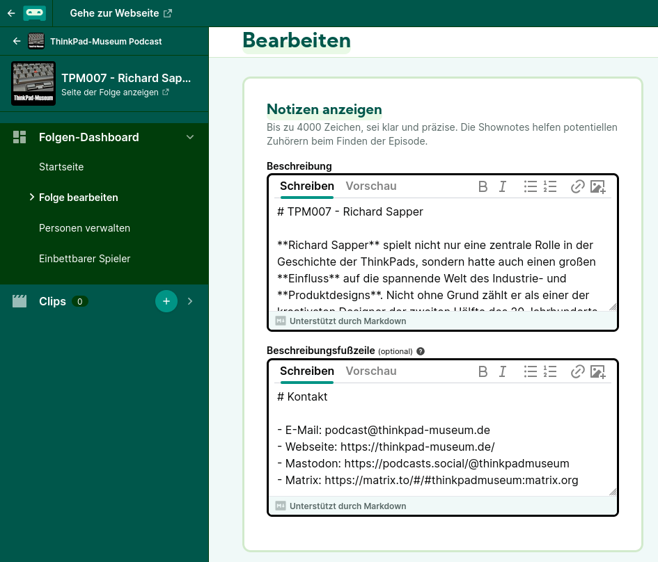

<!--

- ermöglicht mehrere User und Podcast-Feeds

-->

---

<!-- _header: Castopod -->

- in **PHP** entwickelt
- kann u.a. via **Docker** oder Podman gehostet werden

- Fiese **Stolperfalle**: [fehlender `range-requests`-Support im vorgefertigten Container-Image](https://code.castopod.org/adaures/castopod/-/issues/446)
  - zwingend von **Apple Podcasts** für Episodenstreams benötigt
  - Troubleshooting [trotz toller Hilfe](https://sendegate.de/t/apple-podcasts-die-folge-konnte-nicht-wiedergegeben-werden-versuche-es-erneut/16806) war nicht trivial
  - Lessons Learned: [Feed-URL validieren](https://www.castfeedvalidator.com/)

---

<!-- _header: Feed validieren -->

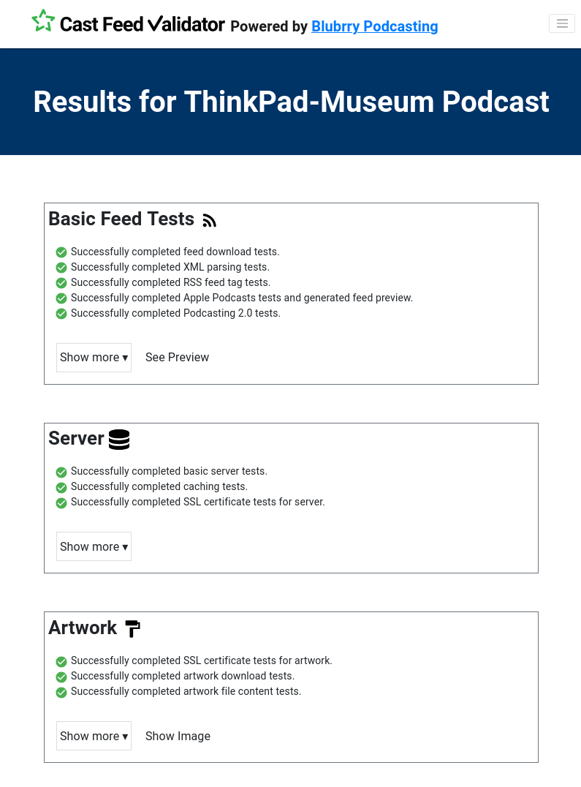

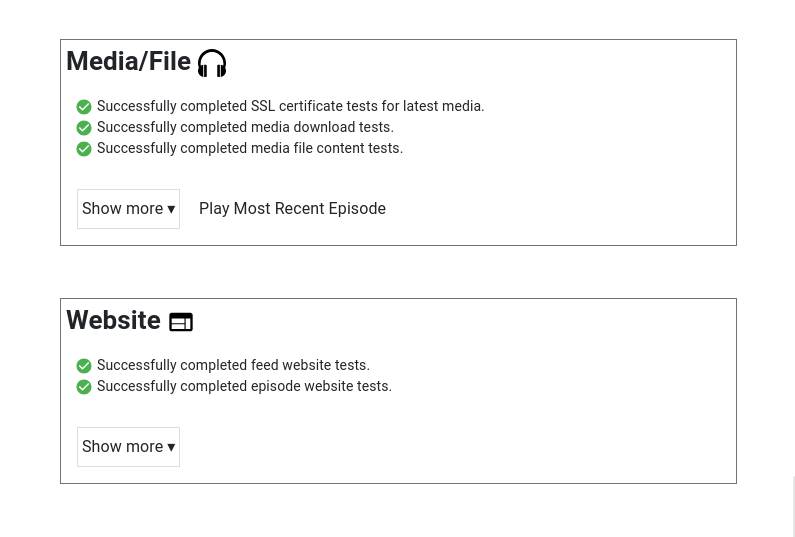

---

<!-- _header: Marketing -->

- Ein Account auf [podcasts.social](https://podcasts.social) ist Pflicht!
  - Posts für **Episoden**, aber auch direkte Community-**Interaktion**
  - Best Practice: Aktuelle Episode ans Profil **pinnen**
  - **Bubble** aufbauen: **Hashtags** verfolgen, an **Konversationen** beteiligen

- Feed in Datenbanken, wie [fyyd](https://fyyd.de/) eintragen
  - oft gibt es auch Special Interest-Projekte, wie z.B. [wisspod](https://wissenschaftspodcasts.de/)
- An anderen **Communities** beteiligen (z.B. [thinkpad-forum.de](https://thinkpad-forum.de))

- Konferenzen wie diese besuchen (duh!)
  - Menschen lieben **Sticker** ✨
- **Kollaborationen** mit befreundeten Podcasts

<!--
- Postet was mit dem #thinkpad-Hashtag und ich antworte euch sehr wahrscheinlich
-->

---

<!-- _header: Analytics -->

- Selbstgehostetes [Matomo](https://matomo.org/) für die **Webseite** (Klicks/Quellen)
- [Mastometrics](https://mastometrics.com) für Mastodon-**Interaktionen**
- [OP3](https://op3.dev/) (**O**pen **P**odcast **P**refix **P**roject) für **Episoden**-Downloads
  - Client-Informationen über Weiterleitungen, erfordert Feed-Anpassung

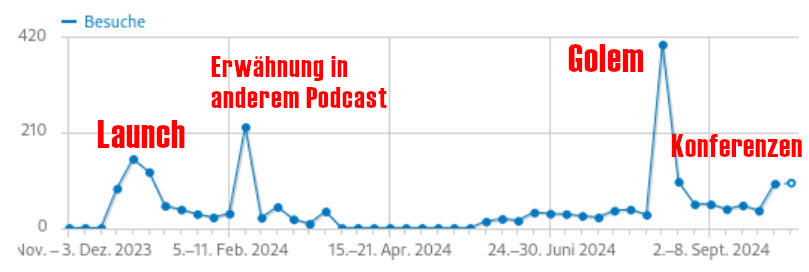

<!--

- Podcasting soll Spaß machen, Analytics bitte nicht zu ernst nehmen
- OP3
  - Open Source-Service für datenschutz-konforme Podcast-Metriken
  - freie API, Quellcode kann auf GitHub eingesehen werden

-->

---

<!-- _header: Analytics (Mastometrics) -->

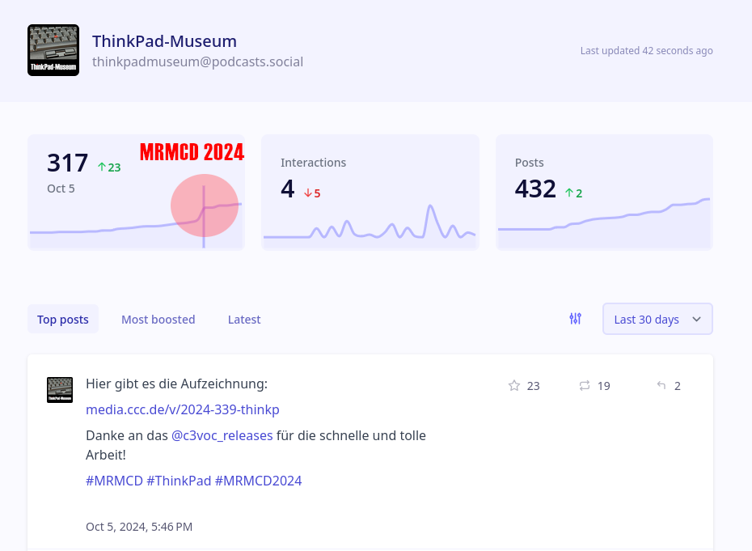

---

<!-- _header: Analytics (OP3) -->

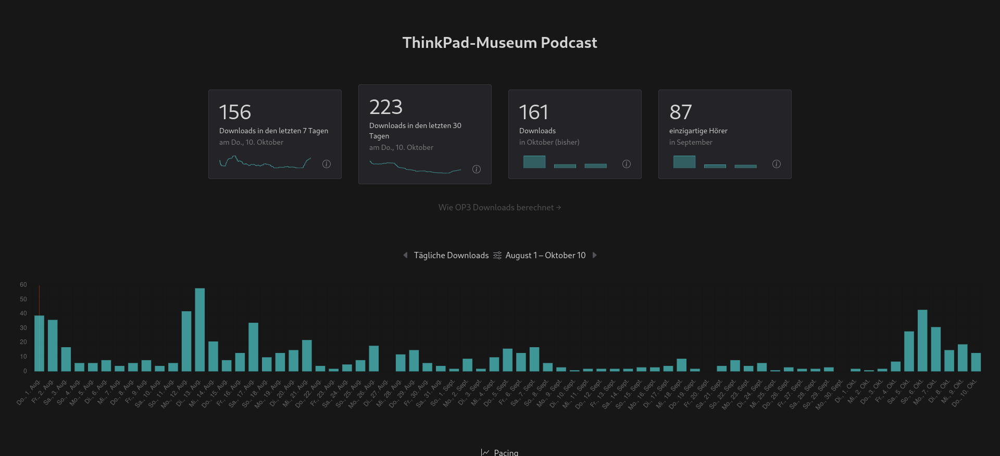

---

<!-- _header: Analytics (OP3) -->

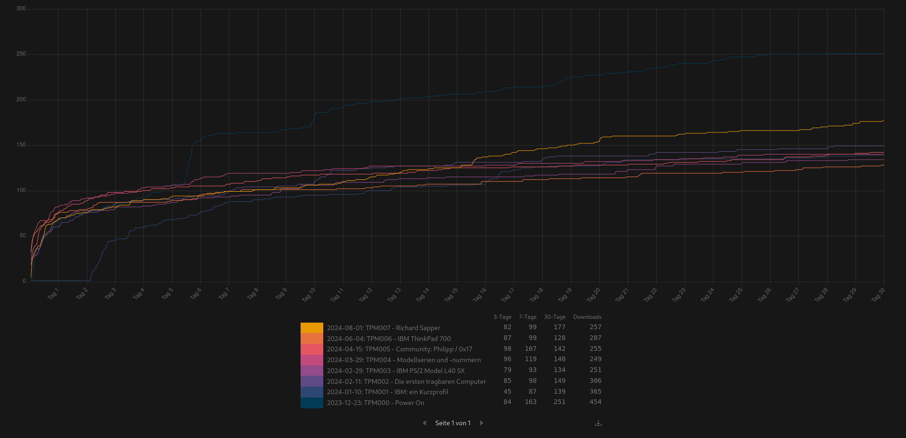

---

<!-- _header: Fazit und Ausblick -->

- Podcasts produzieren **macht Spaß**
  - es gibt für **alles** eine Nischen-Bubble
  - die Podcast-Szene freut sich aber über kuriose Themen
  - probiert es einfach aus - **Vielfalt** ist gut!

---

<!-- _header: Links und Bilderquellen -->

- [MRMCD 2024: ThinkPads - Eingabegeräte und Kuriositäten (Teil 2)](https://media.ccc.de/v/2024-339-thinkpads-geschichte-und-trivia) 🎥
- [FrOSCon 2024: ThinkPads - Geschichte und Nerdkultur (Teil 1)](https://media.ccc.de/v/froscon2024-3141-thinkpads) 🎥
- [BW099 - Ein denkwürdiges Notebook](https://besserwissen.podigee.io/99-thinkpad) 🎙️
- [HK003 - ThinkPads](https://hacker-kultur.de/episodes/003.html) 🎙️
- [ThinkPad Sounds](https://www.youtube.com/watch?v=G9vCBDV4ts4)
- [ThinkPad-Museum](https://thinkpad-museum.de)

1. [IBM PC Convertible Model 5140](https://richardsapperdesign.com/products/mod-5140/)
1. [Artemide Tizio](https://commons.wikimedia.org/wiki/File:Lampe_Tizio_von_Richard_Sapper.jpg)
1. [ThinkPad T61 (Knives Out)](https://productplacementblog.com/movies/lenovo-thinkpad-t61-laptop-used-by-christopher-plummer-as-harlan-thrombey-in-knives-out-2019/)
1. [ThinkPad 701C](https://en.wikipedia.org/wiki/File:IBM_ThinkPad_701C_keyboard.jpg)
1. [ThinkPad W701](https://thinkwiki.de/W701)
1. [IBM Leapfrog](https://richardsapperdesign.com/products/leapfrog/)
1. [ThinkPad 360PE](https://commons.wikimedia.org/wiki/Category:ThinkPad_360PE)

---

<!-- _class: lead -->

# 🔴 Danke für die Aufmerksamkeit
